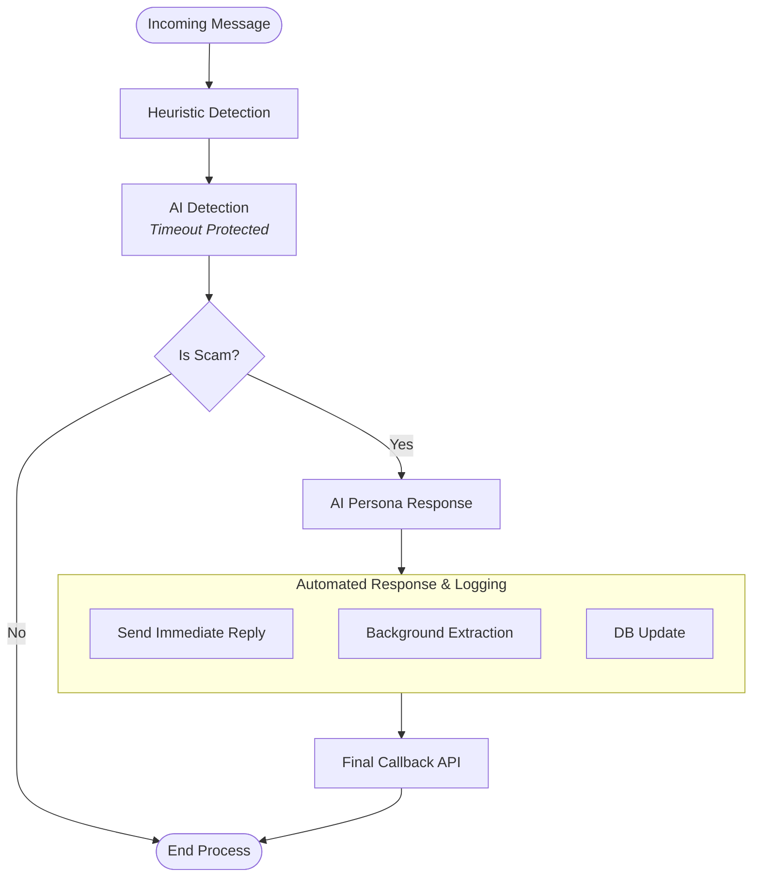

# 🛡️ ScamIntel Honeypot

An AI-powered **full-stack honeypot intelligence system** that detects scam attempts, engages scammers in dynamic multi-turn conversations, extracts structured intelligence, and visualizes results in a modern monitoring dashboard.

Deployed backend on **Render** and frontend on **Vercel**.

---

# 🌐 Live Deployment

### 🔗 Live Demo

🚀 **[View ScamIntel on Vercel](https://honeypot-ewzvvvf6t-ht-projects.vercel.app/)**

---

### 🔹 Backend API

```
POST https://honeypot-fr53.onrender.com
```

### 🔹 Frontend Dashboard

```
https://honeypot-ewzvvvf6t-ht-projects.vercel.app/
```

---

# 🎯 Objective

Instead of immediately blocking scammers, this system:

1. Detects scam intent (Hybrid AI + Heuristics)
2. Engages scammer using AI persona
3. Extracts actionable intelligence
4. Reports structured results via callback
5. Stores full conversation in MongoDB
6. Visualizes sessions in a monitoring dashboard

This simulates a real-world **AI honeypot intelligence trap**.

---

# 🧠 Core Capabilities

## 🔎 Detection Engine

* ✅ Hybrid Scam Detection (Regex + AI scoring)
* ✅ Risk scoring model
* ✅ Timeout-protected AI calls
* ✅ Low-latency decision logic

## 🤖 AI Engagement

* ✅ Multi-turn AI persona
* ✅ Context-aware responses
* ✅ Human-like dynamic behavior
* ✅ Scammer manipulation strategy

## 📦 Intelligence Extraction

* ✅ Structured data extraction
* ✅ Background async worker
* ✅ Final callback reporting
* ✅ Persistent conversation storage

## 🖥️ Frontend Dashboard (NEW)

* ✅ Conversation listing with pagination
* ✅ Conversation detail view
* ✅ Extracted intelligence panel
* ✅ Risk score visualization
* ✅ Scam / Safe badges
* ✅ Dark mode support
* ✅ Mobile-responsive UI
* ✅ AI Interaction Simulator

---

# 🏗️ Project Structure

```
root/
│
├── backend/
│   ├── src/
│   │   ├── config/
│   │   ├── constants/
│   │   ├── controllers/
│   │   ├── middlewares/
│   │   ├── models/
│   │   ├── prompts/
│   │   ├── routes/
│   │   ├── services/
│   │   ├── utils/
│   │   ├── app.js
│   │   └── server.js
│   ├── .env
│   └── package.json
│
├── frontend/
│   ├── src/
│   │   ├── assets/
│   │   ├── components/
│   │   ├── context/
│   │   ├── hooks/
│   │   ├── pages/
│   │   ├── routes/
│   │   ├── services/
│   │   ├── utils/
│   │   ├── app.jsx
│   │   ├── main.jsx
│   │   └── index.css
│   ├── .env
│   └── package.json
│
└── README.md
```

---

## 🖼️ Screenshots


---

# ⚙️ Tech Stack

## Backend

* Node.js
* Express.js
* MongoDB (Mongoose)
* Axios
* Render (Deployment)

## AI Layer

* OpenRouter LLM API
* Prompt engineering
* AI persona modeling

## Frontend

* React.js
* React Router DOM
* Tailwind CSS
* Lucide Icons
* React Hot Toast
* Day.js
* Recharts

---

# 🔍 Scam Detection System

Hybrid model combining:

## 1️⃣ Heuristic Detection (Regex)

Detects:

* UPI IDs
* URLs
* Phone numbers
* Suspicious keywords:

  ```
  verify, blocked, urgent, click, OTP, pay, immediately, transfer
  ```

---

## 2️⃣ AI Detection (Confidence-based)

AI returns:

```json
{
  "scam": true,
  "confidence": 0.82
}
```

---

## 🎯 Final Risk Score

```
Risk = (Heuristic × 0.7) + (AI Confidence × 0.3)
```

If ≥ 0.6 → conversation marked as scam.

Ensures:

* Fast response
* Controlled AI cost
* High detection reliability

---

# 🤖 AI Persona Behavior

When scam is detected, AI:

* Does NOT reveal detection
* Acts confused / concerned
* Asks follow-up questions
* Extracts more intelligence
* Maintains multi-turn memory
* Adapts tone dynamically

---

# 📦 Intelligence Extracted

Structured data extracted:

* 🏦 Bank Accounts
* 💳 UPI IDs
* 🔗 Phishing URLs
* 📞 Phone Numbers
* ⚠ Suspicious Keywords
* 📝 Agent Notes (behavioral analysis)

---

# 🖥️ Frontend Features

## 1️⃣ AI Interaction Simulator

Simulates scam conversation in real-time.

Features:

* Live chat UI
* Risk score visualization bar
* Scam alert indicator
* Explainability breakdown
* New Chat reset

---

## 2️⃣ Conversations Dashboard

* Paginated session list
* Created & updated timestamps
* Scam/Safe badges
* Quick intelligence preview

---

## 3️⃣ Conversation Detail View

Displays:

* Full message history
* Extracted intelligence
* Risk score
* Agent reasoning
* Structured intelligence fields

---

# 🧪 Example Extracted Output

```json
{
  "sessionId": "auto-1771154782489",
  "scamDetected": true,
  "totalMessagesExchanged": 2,
  "extractedIntelligence": {
    "bankAccounts": [],
    "upiIds": ["xyz@upi"],
    "phishingLinks": [],
    "phoneNumbers": [],
    "suspiciousKeywords": [
      "blocked",
      "immediately",
      "pay"
    ]
  },
  "agentNotes": "Customer is being asked to transfer money to unblock account, potential phishing attempt."
}
```

---

# 🗄️ Conversation Model

```
conversationId
messages[]
    role
    content
    timestamp

scamDetected (boolean)
finalCallbackSent (boolean)

extractedData {
    bankAccounts[]
    upiIds[]
    phishingLinks[]
    phoneNumbers[]
    suspiciousKeywords[]
    agentNotes
}

createdAt
updatedAt
```

---

# 🔄 System Flow



Frontend interacts only with stored conversation data.
Backend detection and engagement flow remains unchanged.

---

# ⏱ Latency Optimizations

| Component         | Timeout          |
| ----------------- | ---------------- |
| Scam Detection AI | ~1200ms          |
| AI Agent Response | ~5000ms          |
| Extraction        | Async background |

User receives response immediately.
Extraction & callback run non-blocking.

---

# 🚀 Running Locally

## Backend

```
cd backend
npm install
npm run dev
```

### .env

```
PORT=4000
MONGO_URI=your_mongo_uri
OPENROUTER_API_KEY=your_key
API_KEY=test_api_key
```

---

## Frontend

```
cd frontend
npm install
npm run dev
```

Make sure API base URL points to backend.

---

# 🔮 Future Improvements

* Redis job queue
* Real-time dashboard updates (WebSockets)
* Behavioral scam profiling
* RAG-based scam memory
* Threat intelligence API integration
* Analytics dashboard
* Admin authentication layer

---

# 👨‍💻 Author

Harsh Tripathi

GitHub:
[https://github.com/ImaginationGod/Honeypot](https://github.com/ImaginationGod/Honeypot)

---
